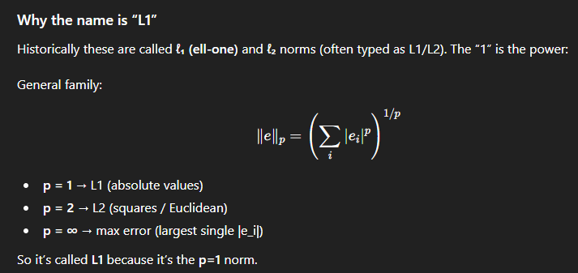

This will be a summary of the research paper:
- [**High-Resolution Image Synthesis with Latent Diffusion Models** (Rombach et al., 2022)](https://arxiv.org/abs/2112.10752)

- [PDF](https://arxiv.org/pdf/2112.10752.pdf)

**Abstract**
So diffusion models start with random noise (pixels are randomly arranged/colors). But this noise has a certain distribution - Gaussian noise aka normal distribution aka bell shaped which means the randomness tends to cluster around the mean.

Gaussian randomness/distribution is kind of needed because out of all distribtuions has the following properties:

- has max entropy (maximally random given variance)

- noising and denoising gaussian results in gaussian so it is predictable as it maintains distribution

Apparently at each denoising step if the model works with text prompts the text embedding is reused every denoising step.

The problem is when the model works on full-resolution pixels and the training takes a lot of GPU resources.

The solution... obviously don't run diffusion on pixels. The actual problem is that ml algorithms compress and learn the information at the same time but we need better compression so:

- first use a pretrained autoencoder to compress images into smaller "latent" representations that still keep important information

- train the diffusion model to denoise in this latent space

**Introduction**

Nothing worth your time except the part about the autoencoder and how that can be trained once and be reused in training different diffusion models in latent space - it learns a good map from image to latent code (encode) and from latent code to image (decode) and this is universal and independent from the diffusion model.

**Related Work**

The general idea... generating images is hard because images are huge.

1) The trade-offs of othe models

- **GANs** make sharp, high-res images fast but are hard to train and often miss parts of the data
- **Likelihood-based model (more stable traning):**
    - VAEs / flow models: easier to optimize, but images often look less sharp / lower quality than GANs
    - Autoregressive models (AR): great at "probability modeling" but slow to sample (pixel-by-pixel / token-by-token) and their architectures can be very expensive - so they often get stuck at lower resolution.

2) Two stage approaches (compress first then model)

To scale to higher resolutions, many methods do:
1. compress the image into a smaller latent representation
2. train a generative model in that latent space

Examples:
- VQ-VAE + AR prior: compress into discrete codes then AR model generates the codes.
- VQGAN / DALL-E-style: use perceptual + adversarial losses to get better latents, then an AR transformer generates them (works, but often needs very high compression to keep AR training feasible -> can hurt details or requires giant models)

What they complained of... AR priors often force a nasty trade-off:
- compress a lot -> lose detail
- compress less -> AR prior becomes too expensive (often billions of parameters)

3) Diffusion models (great quality but expensive in pixel space)

Diffusion models are currently top-tier for quality and density modeling, especially with a U-Net backbone and some training tricks.
But: training and sampling in pixel space is very costly because the model processes full res images for many steps and compute heavy gradients.

4) Let's see why this research paper brings a better approach
I mean... they are combining the best:
- use a strong autoencoder but don't compress too aggressively so details survive
- run the diffusion model in latent space which is lower-dimensional -> cheaper training + faster inference with little quality loss. 
- unlike some prior work that trains the autoencoder and generative model together (which requires delicate balancing) they keep it simpler: train autoencoder first then diffusion which gives more faithful reconstructions.

In plain terms: 
Other latent methods often need extreme compression or huge AR models. pixel diffusion is high quality but expensive. LDMs aim to keep quality while cutting compute by doing diffusion in a well-chosen latent space.

**Methods**
The author proposed splitting the heavy training normally done directly on full-size pixels.
1) Compression stage (autoencoder)
- we train an autoencoder that leanrs to turn an image into a smaller "latent" version and then reconsruct it. The key idea is to have the latent space keep what humans care about visually ("a perceptually equivalent reconstruction") that has a lower domensional space.

2) Generation stage (diffusion):
- train the diffusion model to generate images in that latent space instead of pixel space. The final image is derived from the generated latent that is then decoded by the autoencoder's decoder.

*Perceptual Image Compression*
1. Autoencoder = "zip and unzip" for images

- starting from an imgae x (big grid of RGB pixels):
x ∈ ℝ^(H×W×3)
- then the encoder E zips it into a smaller grid ("latent")
z = E(x) ∈ ℝ^(h×w×c)

- the decoder D unzips it into an image:
x̃ = D(z) = D(E(x)) 

In short: omage -> compact feature map -> reconstructed image

2.  Downsampling factor f = by how much to shrink the image

The paper has a shrink factor as follows:

f = H/h =W/w where H and W are the height and width of the original image and h and w are the height and width of the latent representation.

so if f = 3 then h = H/3 and w = W/3

3. Why pixel losses aren't enough?

p.s. 

L1 = sum of absolute values 
∥e∥1​=i∑​∣ei​∣

i.e. simply add up absolute errors between pixels (generated vs real image)

L2 = Euclidean length (straight length ... the squared version for loss)
∥e∥2​=sqrt(i∑​(ei​)2​)

So using L1/L2 you often get blurry output because the model tries to be right on every pixel and somethimes it can't do that so it averages out details.

4. Perceptual loss = does it look the same?

This compares images using features from a pretrained vision network (often VGG)
VGG aka Visual Geometry group introduced by 
the University of Oxford for image classification (92.7% accuracy on ImageNet)

5. Patch-based adversarial loss = "local realism checker"

They also train a discriminator (GAN-style) but it judges small patches instead of the whole image that ensures the local details are sharp, have realistic textures and no "smudgy blur"

6. Regularising the latent to be more like Gaussian noise - an actual trade off between image fidelity in latent space and how well the diffusion model can learn to denoise it.

The main idea is to make the life easier for the diffusion model to learn to denoise latents by making them more Gaussian-like.

A) KL regularization (VAE-like)

Goal: make the latent space “tidy and predictable.”

How: add a penalty that nudges the encoder’s latents to look like samples from a simple bell-curve distribution (standard normal).

Why it helps: if latents are roughly normal-shaped, later models (like diffusion) can learn/generate in that space more easily because it’s not full of weird spikes or empty gaps.

Tradeoff: push it too hard and you can lose detail (latents get forced to be too “generic”), so they keep it slight.

Analogy: training everyone to speak with a similar accent so communication is easier, but not so strict that you lose meaning.

B) VQ regularization (Vector Quantization, VQGAN-like)

Goal: make the latent space discrete and consistent, like using a fixed vocabulary.

How: instead of any continuous latent vector, each latent “patch” gets snapped to the nearest entry in a learned codebook (a set of prototype vectors).

Why it helps: the model can’t invent arbitrary noisy latents; it must use stable “building blocks,” which often preserves sharpness and reduces jitter.

Tradeoff: if the codebook is too small or quantization too harsh, reconstructions can show artifacts or lose subtle variation.

Analogy: instead of freehand drawing every stroke, you build pictures out of Lego bricks—more stable, but limited by the pieces you have.

