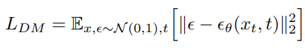
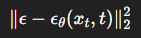
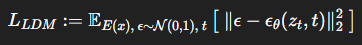
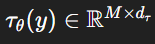

This will be a summary of the research paper:
- [**High-Resolution Image Synthesis with Latent Diffusion Models** (Rombach et al., 2022)](https://arxiv.org/abs/2112.10752)

- [PDF](https://arxiv.org/pdf/2112.10752.pdf)

**Abstract**
So diffusion models start with random noise (pixels are randomly arranged/colors). But this noise has a certain distribution - Gaussian noise aka normal distribution aka bell shaped which means the randomness tends to cluster around the mean.

Gaussian randomness/distribution is kind of needed because out of all distribtuions has the following properties:

- has max entropy (maximally random given variance)

- noising and denoising gaussian results in gaussian so it is predictable as it maintains distribution

Apparently at each denoising step if the model works with text prompts the text embedding is reused every denoising step.

The problem is when the model works on full-resolution pixels and the training takes a lot of GPU resources.

The solution... obviously don't run diffusion on pixels. The actual problem is that ml algorithms compress and learn the information at the same time but we need better compression so:

- first use a pretrained autoencoder to compress images into smaller "latent" representations that still keep important information

- train the diffusion model to denoise in this latent space

**Introduction**

Nothing worth your time except the part about the autoencoder and how that can be trained once and be reused in training different diffusion models in latent space - it learns a good map from image to latent code (encode) and from latent code to image (decode) and this is universal and independent from the diffusion model.

**Related Work**

The general idea... generating images is hard because images are huge.

1) The trade-offs of othe models

- **GANs** make sharp, high-res images fast but are hard to train and often miss parts of the data
- **Likelihood-based model (more stable traning):**
    - VAEs / flow models: easier to optimize, but images often look less sharp / lower quality than GANs
    - Autoregressive models (AR): great at "probability modeling" but slow to sample (pixel-by-pixel / token-by-token) and their architectures can be very expensive - so they often get stuck at lower resolution.

2) Two stage approaches (compress first then model)

To scale to higher resolutions, many methods do:
1. compress the image into a smaller latent representation
2. train a generative model in that latent space

Examples:
- VQ-VAE + AR prior: compress into discrete codes then AR model generates the codes.
- VQGAN / DALL-E-style: use perceptual + adversarial losses to get better latents, then an AR transformer generates them (works, but often needs very high compression to keep AR training feasible -> can hurt details or requires giant models)

What they complained of... AR priors often force a nasty trade-off:
- compress a lot -> lose detail
- compress less -> AR prior becomes too expensive (often billions of parameters)

3) Diffusion models (great quality but expensive in pixel space)

Diffusion models are currently top-tier for quality and density modeling, especially with a U-Net backbone and some training tricks.
But: training and sampling in pixel space is very costly because the model processes full res images for many steps and compute heavy gradients.

4) Let's see why this research paper brings a better approach
I mean... they are combining the best:
- use a strong autoencoder but don't compress too aggressively so details survive
- run the diffusion model in latent space which is lower-dimensional -> cheaper training + faster inference with little quality loss. 
- unlike some prior work that trains the autoencoder and generative model together (which requires delicate balancing) they keep it simpler: train autoencoder first then diffusion which gives more faithful reconstructions.

In plain terms: 
Other latent methods often need extreme compression or huge AR models. pixel diffusion is high quality but expensive. LDMs aim to keep quality while cutting compute by doing diffusion in a well-chosen latent space.

**Methods**
The author proposed splitting the heavy training normally done directly on full-size pixels.
1) Compression stage (autoencoder)
- we train an autoencoder that leanrs to turn an image into a smaller "latent" version and then reconsruct it. The key idea is to have the latent space keep what humans care about visually ("a perceptually equivalent reconstruction") that has a lower domensional space.

2) Generation stage (diffusion):
- train the diffusion model to generate images in that latent space instead of pixel space. The final image is derived from the generated latent that is then decoded by the autoencoder's decoder.

*Perceptual Image Compression*
1. Autoencoder = "zip and unzip" for images

- starting from an imgae x (big grid of RGB pixels):
x ∈ ℝ^(H×W×3)
- then the encoder E zips it into a smaller grid ("latent")
z = E(x) ∈ ℝ^(h×w×c)

- the decoder D unzips it into an image:
x̃ = D(z) = D(E(x)) 

In short: omage -> compact feature map -> reconstructed image

2.  Downsampling factor f = by how much to shrink the image

The paper has a shrink factor as follows:

f = H/h =W/w where H and W are the height and width of the original image and h and w are the height and width of the latent representation.

so if f = 3 then h = H/3 and w = W/3

3. Why pixel losses aren't enough?

p.s. 

L1 = sum of absolute values 
∥e∥1​=i∑​∣ei​∣

i.e. simply add up absolute errors between pixels (generated vs real image)

L2 = Euclidean length (straight length ... the squared version for loss)
∥e∥2​=sqrt(i∑​(ei​)2​)

So using L1/L2 you often get blurry output because the model tries to be right on every pixel and somethimes it can't do that so it averages out details.

4. Perceptual loss = does it look the same?

This compares images using features from a pretrained vision network (often VGG)
VGG aka Visual Geometry group introduced by 
the University of Oxford for image classification (92.7% accuracy on ImageNet)

5. Patch-based adversarial loss = "local realism checker"

They also train a discriminator (GAN-style) but it judges small patches instead of the whole image that ensures the local details are sharp, have realistic textures and no "smudgy blur"

6. Regularising the latent to be more like Gaussian noise - an actual trade off between image fidelity in latent space and how well the diffusion model can learn to denoise it.

The main idea is to make the life easier for the diffusion model to learn to denoise latents by making them more Gaussian-like.

A) KL regularization (VAE-like)

Goal: make the latent space “tidy and predictable.”

How: add a penalty that nudges the encoder’s latents to look like samples from a simple bell-curve distribution (standard normal).

Why it helps: if latents are roughly normal-shaped, later models (like diffusion) can learn/generate in that space more easily because it’s not full of weird spikes or empty gaps.

Tradeoff: push it too hard and you can lose detail (latents get forced to be too “generic”), so they keep it slight.

Analogy: training everyone to speak with a similar accent so communication is easier, but not so strict that you lose meaning.

B) VQ regularization (Vector Quantization, VQGAN-like)

Goal: make the latent space discrete and consistent, like using a fixed vocabulary.

How: instead of any continuous latent vector, each latent “patch” gets snapped to the nearest entry in a learned codebook (a set of prototype vectors).

Why it helps: the model can’t invent arbitrary noisy latents; it must use stable “building blocks,” which often preserves sharpness and reduces jitter.

Tradeoff: if the codebook is too small or quantization too harsh, reconstructions can show artifacts or lose subtle variation.

Analogy: instead of freehand drawing every stroke, you build pictures out of Lego bricks—more stable, but limited by the pieces you have.

Latent Diffusion Models are generative models that learn to create images by learning the reverse of a simple process that gradually adds Gaussian noise to data over T steps: during training a network is given a noisy version of xt of an image x at a random timestep t and learns to predict noise that was added (equivalently, how to denoise), using a squared error objective. Instead of running this expensive denoising process directly in pixel space, the paper first compresses images with a perceptual encoder-decoder pair(E,D) inot a lower dimensional latent space z = E(x) that keeps the important semantic structure while discarding imperceptible high-frequency details; diffusion is then trained in this latent space with the same noise-prediction loss but on zt rather than xt. This makes training and sampling much more eficient and allows using an image-friendly time-conditioned U-Net (mostly 2D convolutions) as the denoiser; at generation time, the model samples a latent z by denoising from noise and then produces the final image by decoding once through D.

Let's explain the formula:

1) Ldm 
Ldm = "loss" (a number you minimize during training)
subscript DM = "Diffusion Model" (just a label)

2) E..[⋅] (the expectation)
This is the big one.
𝐸 means average value.

The subscript tells you what you’re averaging over.

So:

Ex,ϵ,t​[something]

means to sample x,ϵ,t many times and average "something" over those samples.

Why write it this way?
Because the training is stochastic (dealing with randomness and probability): you don't train one image/noise/timestep - you train all of them so you define the objesctive as an average over random sampling process.

In code this expectation becomes: average loss over a minibatch.

3) ϵ∼N(0,1)
- “∼” means is sampled from
- N(0,1) is a normal (Gaussian) distribution with mean 0 and variance 1
In practice ϵ isn’t a single number; it's an entire noise image/tensor same shape as x. people still write N(0,1) as shorthand for “standard normal noise in every component”.

Why specify it?
Because the forward noising process uses Gaussian noise..

4) t(the timestep)
They don't write the distribution here in your line but the paragraph says:
t is sampled uniformly from {1, ...,T}
So you should mentally read: 
t ~ Uniform{1,...,T}
Why random t?
So the model learns to denoise at all noise levels,not just one.

5) xt = noisy version of x at noise level t

This means the img x but after noise was added corresponding to step t

6) ϵθ(xt,t)

This is the model's output
- ϵθ means the model (a neural network) with parameters θ that takes inputs xt and t and outputs predicted noise of same shape as ϵ

Why the θ?
Because training is about finding the best θ (model parameters) that minimize the loss.

The forward process creates xt from x and ϵ.

7) ∥⋅∥2​2​ (squared L2 norm)

This means: take the difference at every pixel/channel, square it and sum it up. Is simply the mean squared error.

The latent diffusion loss is the average squared error between the true noise ϵ and the model's predicted noise, when the model is given a noisy latent latent zt and timestep t.
 
**Personal Thoughts so far**

I really feel that a few things are misleading but regardless, what this paper seems to add new is literally removing pixels that contribute to details humans cannot perceive then run the diffusion on a better dataset... so although it seems that the algorithm is a morecomplex ai algorithm.. all it does is data processing via ai (the autoencoder).

This patterns is noticeable across research papers and in fact is only logical to be so given the architecture of AI is constricted by the hardware is run on thus by matrices thus limiting the learning/representational space to an isolated part of mathematics that is matrix operations. 

**Conditional Mechanisms**
Diffusion models can be taught to generate images with guidance - not just random images - by learning a conditional distribution like "latent image z given some input y", written p(z| y), where y could be text, a semantic segmentation map, or another image for image-to image tasks.

To do this, the denoising network us upgraded from taking only (zt, t) to taking (zt, t, y) so it denoises while listening to the condition.
Because conditioning beyond simple class labels hasn't been explored much for diffusion, the paper makes conditioning more powerful by adding cross-attention inside the U-Net: a separate encoder τθ first turns the condition y (like a text prompt) into a set of features and cross-attention lets the U-Net's internal features selectiely focus on the most relevant parts of those condition features at each denoising step. Training stays the same idea as before - predict the noise  - but now the prediction is forced to be consistent with the condition and both the condition encoder τθ and the denoiser U-Net are trained together; for text, τθ can be a transformer. So the idea with cross attention is to build connections between words and different parts of the image and beacuse the text is embedded via cross-attention it will reflect in the image generation to be close to what the humans want to achieve: i.e. "dog on a cloud" would make the model focus on the dog and one cloud and won't make a dog randomly arround clouds. 

Let's debunk the maths formulas:

Meaning: we run the condition y through an encoder τ to turn it into a table of numbers

τθ (y) is like a list of M ‘tokens’ (chunks) each represented by 𝑑𝜏 numbers (for text: tokens ~= words/subwords)

Next is the cross attention formula that is the same scaled dot-produt attention like in Transformers.

Attention (Q,K,V) = softmax((QxK^T)/(sqrt(d)))xV

in this paper though, we get Q from the U-Net features (WQ​ϕi​(zt​))
K and V come from the condition encoder, where K=WK​τ(y) and V=WV​τ(y). Also in practice it's actually multi-head..just like Transformers

4. Experiments
LDMs are more efficient in training and sampling and sometimes even produce better image quality than pixel based diffusion models. VQ-regularised latent spaces can slightly hurt reconstruction, but can still improve final samples.

4.1 Perceptual compression tradeoffs 
They vary the downsampling factor f ∈{1,2,4,8,16,32} where:
 - LDM-1 = pixel diffusion (no compression)
 - bigger f = more compression

 Result: 4 and 8 bext mix of speed + quality

 4.1 Image Generation with Latent Diffusion
Precision: how many images the model generates look real and high-quality
Recall: how much variety of the real dataset the model can generate

Results: high precision (outputs usually look legit as there are not many broken samples) and decent recall (not collapsing to a tiny set of looks)